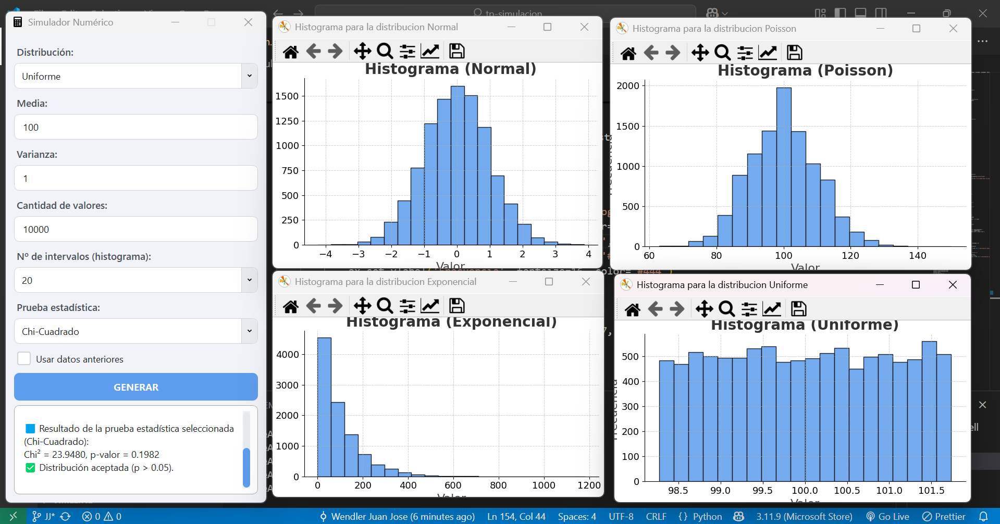

# 📊 Simulador de Variables Aleatorias (con PyQt)

Este proyecto permite generar valores de variables aleatorias según una distribución específica, realizar pruebas estadísticas (como Chi-Cuadrado) y visualizar los resultados mediante una interfaz gráfica construida con PyQt5.

---

## 📚 Documentación

Puedes consultar la documentación oficial de Qt para Python (PyQt) aquí:  
🔗 [https://doc.qt.io/qtforpython-6/](https://doc.qt.io/qtforpython-6/)

---

## 📷 Photos



## 📦 Instalación de Dependencias

Asegúrate de tener `pip` actualizado, luego ejecuta:

```bash
pip install -r requirements.txt

